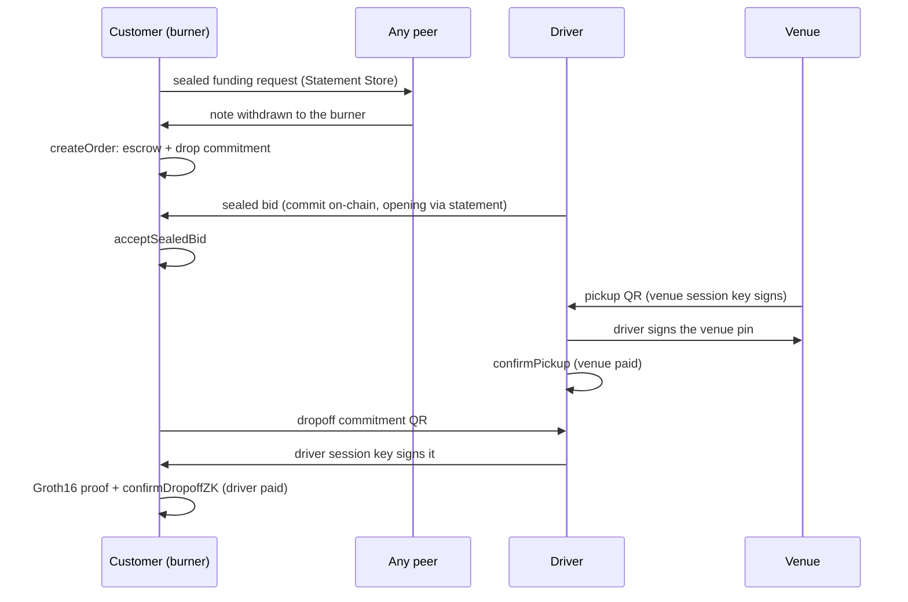

# Porterage — implementation plan

*2026-09-19. The plan of record; later decisions amend it here.*

Porterage is peer-to-peer delivery that lives entirely inside the Polkadot app. Customers, drivers
and venues deal directly: the customer posts an order, drivers bid for the fare in a sealed
auction, and money moves only when the parties whose interests conflict both sign. It inherits
FARE's purpose, contracts, circuits and privacy work
([github.com/Baronvonbonbon/fare](https://github.com/Baronvonbonbon/fare)). The difference is that
it's designed from the start around what the Polkadot app gives a Product, measured on a phone,
rather than around a web app with a relay behind it.

**The rule for infrastructure:** use a Polkadot primitive wherever one works on a phone today. Run
our own service only where none exists, and never make it required. The relay FARE depended on
becomes an optional convenience node.

---

## 1. Decisions

| Area | Decision |
|---|---|
| Runtime | A Product inside the Polkadot app. Mobile for customers and drivers; mobile or Desktop for venues; Desktop for operations |
| Chain | Paseo Asset Hub (pallet-revive). Kusama Shield, the Poseidon and BN254 precompiles, and FARE's deployments are there |
| Contracts | A new version designed around host accounts, ported from FARE's twelve |
| Driver and venue identity | Their host (Polkadot app) account, mapped to an H160 by `map_account`. A personhood gate exists but ships off (§3.4) |
| Signing | A host tap only for rare actions (register, stake, withdraw, admin). A hot **session key**, registered on-chain and kept by the app, signs bids and handoffs with no tap |
| Customer identity | A fresh burner per order, seeded from `deriveEntropy`, so nothing needs backing up |
| Privacy | All of it: sealed-bid auction, ZK proximity dropoff, shielded payouts, sealed per-order messaging. Unlinkable statement identities once the platform allows (§6.3) |
| Money | Any sufficient token in: Coinage (pUSD), PAS, Hollar, USDC, USDT, dotUSD when it ships. Everything is shielded as **PAS in one pool**, so there is one anonymity set, and swapped to the escrow token on the far side |
| Burner funding | Any online participant submits it, paid from the note (§5.3) |
| Gas | PAS. Host PGAS is an upside, not a dependency (§5.5) |
| Relay | Optional: always-online submitter, TURN, push, store-and-forward. Nothing requires it |
| Mainnet | Testnet first. The mainnet gas path is a separate, gated phase (§9) |

---

## 2. What the platform gives a Product, measured

All from sonde runs on a Pixel 10 Pro XL, Android 16, wire codec 1 (`product-sdk-host` 0.19.1,
truapi 0.13.1), 2026-09-19, unless dated otherwise. The details and code live in
[polkadot-host-capabilities](https://github.com/Baronvonbonbon/polkadot-host-capabilities).

| Need | Status | What it means here |
|---|---|---|
| Load as a Product | Works | Publish with a local deploy key, not from the phone ([pitfall](https://github.com/Baronvonbonbon/polkadot-host-capabilities/blob/main/pitfalls/deploy-with-a-key.md)) |
| `fetch`, WebSocket to public RPCs | Works | Talk to Paseo directly; `sendBeacon` is refused |
| Host signing | Works, **always a tap** | AutoSigning answered `NotAvailable`. Nothing host-signed can run unattended |
| App-local keys | Works | EIP-712 sign and recover in 2–7 ms; `deriveEntropy` is deterministic per product |
| Product accounts | Work, but **linkable** | Anyone who knows the user's root key can derive them; never use one as a burner |
| Camera, `BarcodeDetector` | Works | QR decoded in 157–181 ms, 13 formats |
| Geolocation | **Broken** | Refused in 2–7 ms even with host and OS grants (products-devnet-issues #7) |
| Bulletin writes | Work via preimage submit | 64 B in 6.7–29.8 s. `cloudStorage.upload` is refused |
| Bulletin reads | Gateway works; host lookup flaky | The lookup went silent in 4 of 5 runs; read by CID from the devnet IPFS gateway first |
| Statement Store | Works; limits unmeasured | 512 B per statement; **always set an expiry** or the account fills and locks (§6.2) |
| WebRTC | Works | A data channel opens in 1.6–4.4 s at 5.4–6.4 MiB/s; minimal signalling is 387 B |
| Host notifications | Work | 100k chars, 30 scheduled, a year ahead |
| Host local storage | Works up to 4 MiB a record | 8 MiB kills the page |
| Screen Wake Lock | Works | Timers stop while the phone is locked |
| Host PGAS gas | **Needs personhood** | See §5.5 |
| Contract events from host accounts | **Invisible to the Ethereum RPC** | A Substrate `Revive.call` shows no transaction and no `eth_getLogs` entry (Paseo, 2026-09-19). Its events are in `System.Events`, which the Substrate RPC serves for old blocks too. Anything that scans contract logs must fill these gaps (`web/src/shield/pool.ts`) |
| Historical contract reads | Work | The Paseo Ethereum RPC honours `blockTag` for `eth_call` and `eth_getCode` at any depth tested. A light client such as pine-rpc can't: it keeps no history |
| Groth16 on the phone | **Not measured** | 420–645 ms on desktop for the same circuit. Measured first (Phase 0) |

---

## 3. Identity and keys

### 3.1 Keys each party holds

| Party | On-chain identity | Kept by the app | Host taps for |
|---|---|---|---|
| Customer | A burner per order | Burner keys, derived as `deriveEntropy("porterage:burner:" + n)` | Shielding funds (deposit), nothing per order |
| Driver | Host account → H160 via `map_account` | A session key, derived as `deriveEntropy("porterage:session:" + epoch)` | Register, stake, rotate session key, withdraw |
| Venue | Host account → H160 | A session key, as for the driver | Register, set pin and menu, rotate key, withdraw |
| Operations | Host account (Desktop, paired) | — | Every governance action |

`deriveEntropy` gives the same bytes for the same input across restarts and new builds, so the app
can recreate every key it holds from nothing. Still to measure: reinstalling the app, and a second
phone.

### 3.2 Why a session key

Every host signature is a tap (§2), and a driver at a door can't stop for one per step. So the
contracts accept a secp256k1 **session key** that the host account registered, the pattern FARE's
venue hot signer already uses. The session key signs pickup and dropoff attestations and message
envelopes, and it **sends** the day-to-day transactions itself: bid commits, `confirmPickup`, and
the venue's order acknowledgements. The contracts treat a call from a party's current session key
as a call from that party. It holds only a little PAS for gas, topped up from the host account with
one tap now and then, and never holds earnings, which go to the host account's `Vault` balance. If
it's lost or leaked, one host tap rotates it, and its signatures and calls stop counting
immediately.

### 3.3 Contract changes from FARE

- `msg.sender` for drivers and venues is the mapped host account. Registration adds `mapAccount`
  to onboarding, and pays its deposit (FARE's spike S5).
- `PorterDrivers` gains session keys (`registerWithSessionKey`, `setSessionKey`, `actsFor`). A key
  serves one driver; setting a new one retires the old at once. `PorterVenues` already had one:
  the venue's hot `signer`.
- `PorterSettlement` accepts a driver attestation signed by the driver **or its current session
  key** (`setDrivers` wires the registry in). `actor` still names the driver.
- **Session keys never touch money.** Withdrawals and payout notes stay host-signed. A leaked
  session key that could create a payout note could make one only the attacker can spend.
- `FareForwarder` (EIP-2771) is removed. Nothing is meta-forwarded any more: burners pay their own
  gas (§5.4), and hosts pay their own.

### 3.4 Personhood

Drivers and venues are Sybil-gated by the Asset Hub personhood precompile, behind a governance
flag that **ships off**. The project's own test account has no personhood yet (rank "basic"), and
neither will most early testers. It turns on once enough testers are verified.

---

## 4. Order lifecycle

1. **Order.** The customer builds a basket from the venue's menu (on Bulletin), funds a fresh burner
   (§5.3), and calls `createOrder` from it: escrow in the venue's token and `Poseidon(lat, lon, salt)`
   for the drop. The coordinates stay on the phone.
2. **Auction.** Drivers commit a hash of their bid on-chain (`commitBid`, sent by the driver's
   session key, so no tap), and send the opening to the customer sealed over the Statement Store. The customer picks any bid, not just the cheapest (`acceptSealedBid`).
3. **Pickup, no GPS.** The venue counter shows a QR carrying the order and its session-key signature
   over the venue's registered pin. The driver scans it and signs the pin with its own session key.
   `confirmPickup` checks both signatures and the geometry, which passes by construction, and pays
   the venue.
4. **Dropoff, no GPS.** The customer's phone builds the driver commitment from the drop position and
   a fresh salt and shows it as a QR. The driver scans and signs it. The customer proves proximity on
   the phone and submits `confirmDropoffZK`, which pays the driver. The drop location never reaches
   the driver in the clear, and nothing reaches the chain.
5. **Photo.** The driver's delivery photo is sealed (AES-GCM) and stored on Bulletin through
   preimage submit. The driver's session key commits its BLAKE2b key on-chain at once
   (`PorterDisputes.commitEvidence`), before any dispute can exist. It can't go in the dropoff
   attestation: that only reaches the chain when the order settles, and a dispute is opened
   instead of settling. Each party gets one commitment per order, and it can't be swapped.
6. **Rating** follows a delivered order, from the customer's burner.

When the WebView gains geolocation, a real fix is added to both attestations as evidence. The UI
labels every order "settled with GPS" or "settled without GPS".

---

## 5. Money

### 5.1 One pool, any token in

A shielded pool's privacy is its anonymity set. FARE's live runs reached a set of 8 on Paseo. Six
tokens in six pools would split that six ways. So:

- **The pool asset is PAS**, in Kusama Shield's native pool. It's the path FARE proved end to end on
  Paseo on 2026-07-24 (`docs/E2E-FRESH-SHIELDED-REPORT.md`): deposit PAS, withdraw to a fresh burner,
  swap to USDC at the burner, escrow in USDC, deliver, pay out.
- **Any other sufficient token** (pUSD, Hollar, USDC, USDT, dotUSD) is swapped to PAS through Asset
  Hub's asset conversion **before** shielding, from the user's own host account. That swap is public,
  but it happens before the shield boundary.
- **Escrow is in whatever token the venue accepts.** The burner swaps PAS into it after withdrawal
  (FARE's `coverageSwap`). Prices stay in the venue's token; only the private hop is PAS.
- **Payouts leave the same way:** into the pool as PAS, and out as whatever token the driver or venue
  asks for.
- **Liquidity is the risk.** Each token needs a PAS pair on Paseo. Phase 3 checks every pair and drops
  any token without one. pUSD also waits on FARE's spike S4: can a contract hold it despite its
  transfer restrictions?

### 5.2 Shielding (customer)

The customer's host account deposits PAS into Kusama Shield: one tap, any time before ordering, like
topping up a card. Notes stay on the phone in host local storage, encrypted with a key from
`deriveEntropy`. A note covers the order's value, its gas, and the funding fee.

### 5.3 Funding a burner: the open market

A fresh burner has no gas to submit its own withdrawal, and the customer's host account must not
submit it, or the two are linked on-chain. So the customer posts a **sealed funding request** on a
public Statement Store topic: the proof, its public inputs, the burner address, and a fee the note
pays. A Groth16 proof and its inputs are about 420 B, so the request fits in one 512 B statement.

Any online participant (a driver waiting for work, a venue counter, the optional relay) picks it
up and submits `proxy_withdraw`, and the note pays their fee. The first valid submission wins, and
the others get "nullifier spent" from a dry run and lose nothing.

- **Submitters sign with an app-local key, not the host.** Host signing is always a tap, and this
  must run unattended. They pay the gas in PAS, and the fee covers it with a margin.
- **No willing peer online:** the request waits, or the customer re-posts it with a higher fee. The
  relay, if running, is the submitter of last resort.
- **Privacy:** the submitter is a random peer, and nothing on-chain links it to the customer.

### 5.4 Burner gas

The withdrawal delivers PAS, so the burner pays its own gas from the same note, and then swaps the
rest into the escrow token. No gas grant and no meta-transactions are needed. (On Paseo, EVM
transactions can only pay fees in PAS; fees in other assets are unconfigured. FARE probed this in
July 2026.)

### 5.5 Host PGAS: an upside

The host can pay gas in PGAS through `SmartContractAllowance`, but the claim needs a ring-VRF
personhood proof. On 2026-09-19:

- Paseo Asset Hub: no PGAS claim at all; the chain refused an unfunded account's transaction.
- Asset Hub Next: the host tried to claim and failed to build it. The test account had no
  personhood.

So drivers and venues pay PAS from their host account, starting with a one-time grant at onboarding
(the testnet faucet, or the optional relay). When a verified person's host does claim PGAS on the
contracts' chain, the app uses it for host-signed transactions automatically.

### 5.6 Payouts

Drivers and venues are paid through `PorterVault` pull payments. For a private exit, a payee turns a
fixed-denomination part of their balance into a **note** (one host tap), and later spends the note
into Kusama Shield with a Groth16 proof that reveals only a nullifier (FARE privacy phase 3). Every
unspent note is the anonymity set. The proof fixes where the money goes, so **anyone** can submit
the spend: the same open market as burner funding (§5.3), with no keeper and nothing to redirect.

---

## 6. Messaging and data

### 6.1 Where each kind of data goes

| Data | Transport | Why |
|---|---|---|
| Funding requests, bid openings, presence | Statement Store | Small, public-but-sealed, needs no connection |
| WebRTC offers and answers | Statement Store, one statement per party per order, replaced in place | The minimal offer is 387 B |
| Chat, live photos, live position (when GPS works) | WebRTC data channel | Measured working in the app |
| Delivery photo evidence | Bulletin (preimage submit) | Lives about 14 days, the dispute window |
| Menus | Bulletin, re-uploaded by the venue before expiry | A Product can't renew what the host stored |
| Chat when the other side is offline | Bulletin (sealed) with a statement pointing to it | Store-and-forward with no server |
| Notifications | Host notifications, scheduled | The app has no Push API |

Everything on the Statement Store or Bulletin is sealed with the order's E2E keys (FARE's `msg.ts`:
ECDH → HKDF → AES-GCM). Topics are derived from secrets the two parties share, never from the order
id, which anyone can compute.

### 6.2 Statement Store rules

- **Always set an expiry.** A statement without one is kept at `i64::MAX`, and once an account is
  full of them it refuses every new statement. sonde's own account is locked this way.
- Budget per account is small and not yet measured on a clean account; measure it in Phase 0.
- Replace a party's statement for an order in place rather than adding new ones.

### 6.3 Unlinkable statements

Statements are signed by the product's allowance account, the same for all of a user's orders.
Sealing hides content, not the fact that the same user sent them. Unlinkable per-order identities
need a per-order allowance (FARE's spike S3) or Ring VRF aliases (`getAnonymousAlias` returns `null`
today). Until one lands:

- Customers send as few statements as possible: the funding request (through a peer, §5.3), bid
  acceptance, and the WebRTC offer.
- The gap is shown in the UI, and the feature switches on when either primitive works.

---

## 7. Surfaces

| Surface | Runtime | Screens |
|---|---|---|
| Customer | Polkadot app (mobile) | Venues and menus, basket, shielded balance, order tracking, dropoff QR and proof, rating, chat |
| Driver | Polkadot app (mobile) | Onboarding (map, stake, session key), order board, sealed bidding, pickup scan, dropoff scan, photo, earnings and payout |
| Venue | Polkadot app (mobile or Desktop) | Onboarding, menu editor (Bulletin), order tickets and kitchen view, pickup QR, payouts |
| Operations | Polkadot Desktop | Disputes, governance, pause, upgrades (FARE's `web/src/ops/`) |

One build serves all four, choosing the view by role. Outside the app it runs read-only.

---

## 8. Phases

Each phase ends with something that runs on a phone.

### Phase 0 — Measure what's left (sonde) — *skipped for now, 2026-09-19*

- [ ] Groth16 proximity proof on the phone (`web.limits.groth16`). **Gate:** under 10 s and it
      verifies; otherwise proving moves to a helper and the plan changes.
- [ ] Backgrounding: timers, WebSocket and subscriptions after 30 s away.
- [ ] Statement Store limits on a **fresh** label: exact size, per-account capacity, expiry,
      delivery latency between two phones.
- [ ] Preimage submit at photo size (about 3 KiB).
- [ ] `deriveEntropy` after reinstalling the app, and on a second phone.
- [ ] WebRTC between two phones on different cellular networks.

### Phase 1 — Contracts

- [x] Port FARE's contracts: `PorterDrivers` and `PorterVenues` (session keys, personhood flag),
      `Orders` (sealed bids, escrow in any accepted token), `Settlement` (session-key checks), `Vault` (pull
      payments, ZK payout notes), `Disputes` (evidence key committed at
      dropoff; opening and ruling clocks inside 14 days), `Ratings`, `GovernanceRouter`,
      `PauseRegistry`, and the two verifiers. **Done 2026-09-19:** ported from FARE with the forwarder
      removed, driver session keys, event-time evidence (`PorterDisputes.commitEvidence`) and an
      off-by-default personhood gate. 178 tests pass.
- [x] Carry FARE's tests over, and add session keys, evidence and the personhood gate.
- [x] Deploy to Paseo Asset Hub (EVM bytecode, 2026-09-19): `npm run deploy-key` once, then
      `npm run deploy`. All 17 wiring checks pass; the full deploy cost about 9 PAS. Addresses are
      in `deployed-addresses.json` and `web/src/deployed.json`.
- [ ] Build the PolkaVM target too, with the 256 KiB blob gate.

### Phase 2 — The app shell

- [x] Product scaffold on `product-sdk-host` 0.19.1 (wire codec 1; newer codecs hang the current app).
- [x] Every host call with a deadline; detection of the host.
- [x] Key derivation (§3.1) from `deriveEntropy`, and driver onboarding: register with a session
      key, fund it, rotate it. Host accounts call contracts through `Revive.call`; this runtime maps
      accounts automatically, so there is no `map_account` step. Not yet tried on a phone.
- [x] Publish to a `.dot` label with a local deploy key: `porterage.dot`, owned by the name key (docs/DEPLOY.md).

### Phase 3 — Money

- [x] Kusama Shield deposit of PAS from the host account: ladder notes, one tap for all of them
      (`Utility.batch_all`), note secrets derived from `deriveEntropy`, bookkeeping encrypted in host
      local storage. Verified live from node on 2026-09-19 (leaves 372–373 reach the live root);
      not yet from the phone.
- [x] Swaps into PAS before shielding: a host account calls asset-conversion directly (no XCM, no
      precompile), and the swap and the deposits go in one `Utility.batch_all` — one tap. Tokens with
      a live PAS pool on Paseo (2026-09-20): **USDC 1337, USDT 1984, pUSD 50000413**. Hollar and dotUSD
      have no asset there. Verified live: 298 USDC swapped and shielded as 25 + 25 + 5 PAS notes in one
      transaction, all three paths reaching the live root.
      **Two limits found:** a deposit takes about a quarter of a normal extrinsic's proof budget, so a
      tap carries at most 3 notes (`MAX_NOTES_PER_TAP`) or the batch is refused as `ExhaustsResources`;
      and an asset account can't be emptied (`Token(NotExpendable)`), so a swap leaves the minimum
      balance behind.
- [ ] From PAS into the escrow token at the burner. A burner signs Ethereum transactions only, so this
      needs the XCM precompile's `ExchangeAsset` (FARE's `venue-node/swap.mjs`). It's only needed once
      escrow is in a token, which is Phase 4.
      **Read FARE's module before building this — it carries a correction that applies here**
      (2026-09-20). A burner making a distinctive-amount DEX swap is a timing-and-amount
      correlation with its own funding deposit: the exact link the burner exists to break. So the
      swap belongs on the funder's side of the anonymity boundary, not the burner's. Kusama Shield
      is a MULTI-asset pool (`depositAsset(assetId, value, commitment)` — already in
      `shield/pool.ts`, and notes commit to the asset), so the right shape is to shield the escrow
      token itself and have the burner withdraw token notes, never touching a DEX. Also measured
      by FARE: there is **no asset-conversion precompile** (code at only two precompile addresses,
      the XCM one at `0x…0a0000`), so an EVM key reaches the pallet either through the XCM
      precompile's `ExchangeAsset` or `revive.ethSubstrateCall`.
      Nothing needs it today: every order the app opens escrows native PAS (`openOrderERC20`
      exists on the contract and is never called), so this stays open and unbuilt rather than
      built on the wrong side.
- [x] Withdrawal to a fresh burner: the proof (Kusama Shield withdraw_v7, 32.8 MiB key shipped with the
      app and checked by SHA-256), a derived change note, and recovery of requests left over from an
      earlier session. Verified live from node on 2026-09-19: deposit, an 11.4 s proof, a submission
      from a different key (32,490 gas), 0.4 PAS at the burner, and the change note's path reaching the
      live root.
- [x] The funding market: a 426-byte request on the Statement Store (topic `porterage:fund:v1`, one
      channel per requester, one hour's expiry), submitters on drivers' session keys ("Help fund
      private orders") and the optional relay (`npm run relay`), which reads both People chains.
      **Fee:** the burner tips the submitter after it's funded. The proof binds only the recipient, so
      the tip is on trust; a fee splitter the proof pays into is the mainnet fix (§9).
- [ ] From the phone: the proofs' time there, and requests posted by the host reaching a submitter.
- [x] Private payouts, the ZK note path only (no keeper): the deploy wires the shield verifier, the
      Poseidon precompile, Kusama Shield's pool and the 1/5/25/100 PAS buckets. A payee turns a bucket
      of vault balance into a note (one tap), then proves ownership of one note among many and posts
      the spend to the market; a stranger submits it and the money arrives as an ordinary pool note.
      Verified live on 2026-09-19: credit, insert, a 2.2 s proof, a submission from a key that never
      held the note (27,295 gas), and the pool note reaching the live root.

### Phase 4 — Delivery

- [x] Order creation, sealed bidding, acceptance. The customer places an order from a fresh account
      funded out of the private balance (one flow: prove, post, fund, create, announce), carrying only
      `Poseidon(lat, lon, salt)`; the salt stays on the phone. Drivers read open orders straight from
      the contract (no event log, so orders from any kind of account appear), commit a bid hash with
      the session key and send the terms encrypted to the order account's key over the Statement Store
      (ECDH, a fresh key per bid, 127 bytes). The customer may take any bid.
      Verified live on 2026-09-20: venue, driver with a session key, order, sealed bid, acceptance.
- [x] Pickup and dropoff handoffs by QR, with the proof on the phone. Codes are versioned binary in
      base64url, so each also pastes as text when a camera is refused: pickup 122 characters, the
      customer's door code 67, the driver's reply 111. The scanner uses the host's `BarcodeDetector`
      and falls back to jsQR. The proximity artifacts are only 3 MB, unlike the pool's 35 MB.
      Verified live on 2026-09-20 (`web/tools/live-order.ts`): venue, driver, order, sealed bid,
      acceptance, pickup (venue paid 1.0 PAS), a 923 ms proximity proof, settlement (driver paid
      1.4625 PAS after the fee) — and neither the drop, its salt nor any coordinate appears in what
      was sent.
- [x] A map for choosing the drop, instead of typing coordinates. Raster OSM tiles
      in plain `` tags (`views/MapPick.tsx`, arithmetic in `order/tiles.ts`),
      no map library: the pin is the centre of the view, so dropping it is panning.
      It starts at the venue, because the WebView won't give a position. Opt-in and
      labelled: the tile server sees the rough area, typing coordinates sends nothing.
- [x] Order messages between the three parties (§6), on the same sealed-envelope footing. A thread is a
      PAIR, and its topic is the ECDH secret between the two parties' keys — so unlike the order topic,
      which anyone can compute from an order id, **a thread can't be found at all without one of the two
      private keys**, and what's on it is sealed as well. Each side keeps ONE statement, replaced in
      place (§6.2): a rolling window of its own recent messages, so a thread costs two statements
      however long it runs and the oldest messages age out. No message carries a sender — an envelope
      is sealed with a throwaway key, so the statements a device can open are exactly the ones it did
      not send, and its own side comes from encrypted local storage. Keys reach each other by a sealed
      `introduce` on a topic the pair already share: the driver says hello on the order's topic once it
      has the job, and the customer on the venue's topic with the basket (a basket alone can't be
      replied to, being sealed with a throwaway key). `web/src/order/chat.ts`, one `Thread` component
      for all three roles. Verified live on 2026-09-20 (`web/tools/live-order.ts` step 10): both sides
      derived the same topic, a third party with both public keys did not, and two messages fit one
      178-byte statement that the venue could not read.
- [x] Photo evidence: the driver photographs the delivery, it's sealed to the two of them, stored on
      Bulletin, and its key is committed on-chain (`commitEvidence`) before the order settles — a
      disputed order never settles, which is when the photo matters. The sealing key is the ECDH
      secret between the driver's session key and the order account, and **nothing extra is sent**:
      the driver already has the order account's key from the auction, and the customer recovers the
      driver's from the signature it was handed at the door. Verified live on 2026-09-20 (the
      recovery, the sealing, and the commitment); the Bulletin write itself needs a phone.
      Still open: a copy of the key sealed to an arbiter, for Phase 6.
- [x] Venue menus on Bulletin: a small public JSON document, pointed at by the venue's on-chain
      metadata, read by customers before they have any account. The basket sets the order's goods
      value. **Not sealed**, deliberately — a menu says nothing about who orders from it.
- [x] The kitchen view: the basket travels to the counter sealed to the key its menu publishes, on the
      venue's own topic, so the kitchen sees its orders and nobody else sees either the items or who
      asked. The chain still says only which venue and how much. 12 bytes for an order with two items,
      before sealing.

- [x] Distance filtering, both sides (2026-09-20). A pin kept in the device's encrypted storage,
      set on the map or typed, with a radius — never published, because the filtering happens here on
      a list the device already has, so nobody learns what anyone searched for. Customers see venues
      within the radius, nearest first, with their ratings; drivers see jobs whose **pickup** is
      within it, which costs nothing because a venue's pin is already public on-chain.
      Drop distance is the interesting half. An order carries only Poseidon(lat, lon, salt), so a
      driver bidding has no idea whether the trip is round the corner or across the city. A customer
      MAY publish a coarse area — opt-in, per order, never automatic (`web/src/order/area.ts`), shown
      with what it costs before it is sent. It is a **fixed grid, not a fuzzed position**: a published
      point of "the drop plus a random kilometre" would be an independent sample each time, and
      several orders from one address would average down to the doorstep. A grid gives the same
      square every time, however many orders are placed, and it never narrows. Cells are about 1.1 km
      and the longitude step is scaled by latitude, so a cell doesn't quietly shrink to 500 m up north
      while still claiming a kilometre. Drivers see "drop: about 2.3 km from the venue", or "not said
      — you'll learn it at the door" for the customers who didn't opt in.

### Phase 5 — Messaging

- [x] Statement Store channels with expiry, sealed. Every publish sets one, and every party's
      statement goes on its own channel so a new one replaces the old rather than filling the
      account. Done as the bids, baskets and threads were built.
- [x] WebRTC chat over statement signalling. A data channel opens beside the thread when both sides
      are online, and messages go down it at once while the statement window is still published, so
      an absent peer catches up — the statements stay the transport of record rather than a fallback
      nobody maintains. The signalling fits because an SDP is nearly all boilerplate between two runs
      of the SAME app: cut to ice-ufrag, ice-pwd, the fingerprint and the candidates, and written as
      binary (a fingerprint is 32 bytes, not 95 characters of hex; an IPv4 candidate is 11, not 60),
      a 587-byte offer becomes **113 bytes, 176 sealed** — a statement holds 512. The peer rebuilds
      the rest from a template. Which side calls is settled by comparing public keys, so both agree
      without a message. `npm run test:rtc` bundles `web/tools/rtc-entry.ts` and runs a real
      handshake in headless Chromium — the same engine family as the app's WebView — through the
      encode/decode/rebuild path, and a message crosses it.
      **Not proven and cannot be here:** that two phones can reach each other. There is no STUN or
      TURN, so this connects peers on the same network and otherwise fails silently into statements.
      A relay would fix it (Phase 8), and needing one is exactly why it is optional.
- [x] Bulletin store-and-forward for a conversation that outgrows a statement. The window drops its
      oldest messages once the transcript passes 448 bytes; before that happens the whole transcript
      goes to Bulletin, sealed to the same reader, and the statement carries its 32-byte key. The
      reader fetches it once and merges, keyed by time and text so the overlap doesn't double up.
      Deliberately **not per message**: a Bulletin write goes through the host and may cost a tap, so
      it happens only when the window is about to lose something not yet stored — and it stores
      everything said so far, which buys another windowful before the next write. If Bulletin isn't
      there or the host refuses, the message still goes and the oldest still age out, exactly as
      before.
- [x] Host notifications for bids, acceptance and arrival (`web/src/notify.ts`), through the host's
      own surface since the app has no Push API. **A notification names a kind of event and nothing
      else** — no order, no amount, no address, no venue. It goes through the host, and the host
      knows which person it is delivering to, so "your order #7 has a bid of 1.5 PAS" would hand over
      the one link the rest of this design spends everything avoiding. Whoever taps it sees the
      detail in the app, where it is nobody else's business. Each kind fires once per order per run,
      or the polling the order screens already do would repeat it every few seconds.

### Phase 6 — Disputes, ratings, operations

- [x] Dispute filing with the committed photo key and the arbiter-sealed key. The photo is now
      encrypted under a **content key of its own**, which is what gets wrapped to the other party —
      so the key to one photo can be handed to an arbiter without handing over the identity key that
      wrapped it, which would open every other photo, message and bid that key has touched. The case
      (the reason, and that content key) is sealed to the arbiter and travels in the dispute's own
      `evidenceURI`, not on Bulletin: the burner sends the transaction, but a Bulletin write is
      signed by the phone's host account, which would tie the order to the person filing it. The
      arbiter's public key ships in the address book and is **refused unless it hashes to the address
      the contract names** — an address is a hash, so it cannot be encrypted to. A customer files from
      the order's burner (no tap); a driver files from its own account (one tap), because the contract
      asks for a party and a session key is not one. `web/src/order/{arbiter,dispute}.ts`. Verified
      live on 2026-09-20 (`web/tools/live-dispute.ts`): filed, the driver could not read the case, the
      arbiter read it and opened the photo, the same key opened no other photo, and the ruling split
      the escrow 75/25 and left a strike on the driver.
- [x] The Desktop operations console. Not a second app: a link under the role chooser, meant for
      Desktop but the same Product (`web/src/views/Ops.tsx`, queue in `web/src/ops/queue.ts`). It
      shows the open disputes with the order, the escrow, the driver's record and what evidence was
      committed — all of which is public on-chain anyway — and **refuses to pretend to authority it
      hasn't got**: a case is sealed to the arbiter, so a device that isn't the arbiter can read the
      queue and nothing else, and it says so instead of offering buttons that would revert. The
      ruling arithmetic is FARE's `ops/ruling.ts`, carried over and tested against
      `PorterOrders.resolveDisputed`, including that the driver takes the truncation remainder so no
      wei is stranded; a preview that disagreed with the chain would mislead an arbiter about a
      ruling that cannot be taken back. The arbiter key must be secp256k1 (`keys.ts opsKey`), because
      a case is sealed by ECDH on that curve and an sr25519 host account cannot take part.
      `web/tools/ops.ts` is the same queue and the same arithmetic on the command line, which is what
      can rule today, the arbiter being the deploy key on this computer. Verified live on 2026-09-20:
      `live-dispute.ts --leave-open` left dispute #3 standing, the console read its sealed case, and
      `ops.ts rule 3 6000 --fault --slash 1` split 2.5 PAS into exactly the 1.5/1.0 it previewed.
- [ ] Changing the arbiter needs a republish: the app is built with the arbiter's public key (checked
      against the address the contract names). Somewhere self-verifying and on-chain would be better.
- [x] Ratings and reputation. One rating per delivered order, sent by the order's own burner, so it
      says what the order was like and nothing about who placed it — reputation that can't be traced
      back to a person is the trade this design keeps making. Stars show where the choices are: on
      each venue in the picker, on each bid in the auction, and on the driver's own Work screen.
      Verified live on 2026-09-20 (`web/tools/live-order.ts` step 11), second rating refused.
- [ ] A fairer arbiter than one address. The testnet arbiter is the deploy key, which is the plainest
      centralisation left: it can rule on any dispute. The contract already routes upgrades through
      `PorterGovernanceRouter`; the arbiter should go the same way.

### Phase 7 — Live test

Three phones, one per role, on Paseo, with no relay running: a full order from shielded funding to
payout. It passes when the order is `Delivered`, every party was paid, and no service of ours took
part.

### Phase 8 — Optional relay

A small node that submits funding requests, relays TURN, stores and forwards messages, and pushes
notifications. Each is a convenience, turned on per region.

---

## 9. Mainnet path (gated)

Not started until Phase 7 passes. It needs:

- Funding-market fees that cover real gas prices, and enough online submitters. The tip must stop
  being on trust: withdraw to a fee splitter at a CREATE2 address derived from (burner, fee), so the
  proof itself fixes both payments, and anyone can then split it.
- An anonymity set large enough to mean something.
- Evidence storage and contracts on networks with the same lifetime (the devnet resets).
- A trusted setup with more than one party (FARE's single-party ceremony doesn't carry over).

---

## 10. Questions for Parity

1. Can a Product ask the host to claim PGAS to an **account it names**, such as a fresh burner? The
   chain allows any `target`; truapi only takes a derivation index.
2. Is AutoSigning planned for mobile, and with what limits?
3. Why does `getChainSpec` answer for Paseo Asset Hub and never for the Next chains?
4. When will `getAnonymousAlias` return an alias, and is a per-order statement allowance planned?
5. When will the WebView answer geolocation requests (issue #7)?

---

## 11. Carried over from FARE

| From FARE | Becomes |
|---|---|
| `contracts/*` (12) | §3.3 and Phase 1 |
| `circuits/proximity.circom`, `shieldnote.circom`, verifying keys | Unchanged |
| `web/src/msg.ts`, `channel.ts` | Sealing unchanged; transports replaced (§6) |
| `web/src/shieldpool.ts`, `shield.ts` | The Kusama Shield engine, unchanged |
| `web/src/handoff.ts` | GPS-free pickup and dropoff, unchanged |
| `web/src/photo.ts`, `photoflow.ts`, `host.ts` | Photo sealing and preimage upload |
| `web/src/sealedbid.ts`, `kitchen.ts`, `ticket.ts`, `menu.ts` | Auction, venue tickets, menus |
| `web/src/ops/*` | The operations console |
| `venue-node/relay.mjs`, `push.mjs` | The optional relay (Phase 8) |
| `venue-node/scorer.mjs`, `agent.mjs`, Kubo, Caddy, the Cloudflare functions | Retired |
